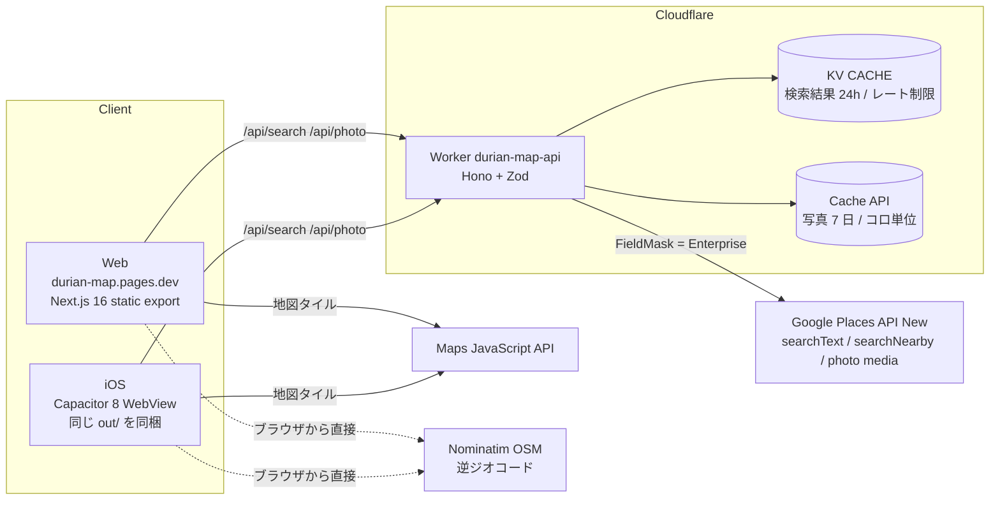

# Durian Map 総合レビュー（2026-09-15）

対象: `main`（`7d1142f`）と未マージだった `GaloisExtension/iOS`（`62f8479`）、本番の Worker / Pages。
観点: (1) 実装と方向性 (2) 個人アプリとしての費用・ビジネス (3) 技術的な展開のしやすさ。
コードレビューは security-reviewer / react-reviewer のサブエージェントに独立して実施させ、
指摘はすべて自分で本番 API・ビルド成果物に対して再検証した。料金は一次情報（Google / Cloudflare 公式）を当日確認。

---

## 0. 結論（5 点）

1. **方向性は正しい。** 「API 1 つ・UI 1 つ・iOS は Capacitor」「チェーン判定はサーバー側 1 箇所」「Web/iOS 差分は `lib/` に閉じ込める」は、
   個人開発の規模に対して最も保守コストが低い構成で、実際に UI が 500 行書き換わっても iOS 側の再適用が 12 箇所で済んだ実績がある。
2. **ブランチの乖離が最大のリスクだった。** 本番（Worker も Pages も）は `GaloisExtension/iOS` 側の成果物で動いているのに、`main` は
   1 日前の状態で「フロント未デプロイ」と書かれていた。両ブランチが同じ Worker を別々にデプロイして互いを上書きする事故が 2 回起きている。
   → 本レビューの作業ブランチで **iOS ブランチを `main` 系に統合済み**（`e926842`）。
3. **費用の主因は Google Places の「Enterprise ティア」と「写真」。** 検索は 1 回 $0.035（無料 1,000 回/月）、写真は 1 枚 $0.007（無料 **1,000 枚/月**）。
   1 検索で 15〜19 枚の写真を出すので、**趣味利用でも写真代が月 $20 前後**になり得る。キャッシュ設計を直すと 1/10 にできる（§2）。
4. **API が無認証のまま課金 API を代行している。** `category` が自由文字列で Places に届き、`/api/photo` は任意の写真をサイズ違いで
   256 万通りの URL として取れる。CORS はブラウザ以外を止めない。KV レート制限は無料枠 1,000 writes/日を約 50 検索で使い切り、
   切れるとレート制限とキャッシュが同時に死ぬ。→ P0 で修正（§5）。
5. **UI は規約遵守が良好で、負債は「見えにくい層」に集中。** フォントの preload 358 ファイル / 5.3MB、1,383 行の単一コンポーネント、
   Nominatim をブラウザから直叩き、起動直後の位置情報要求、ディープリンクの書き戻しなし。→ P0/P1 で段階的に解消。

---

## 1. 現状の把握

### 1.1 構成（統合後）



| レイヤ | 状態 | 備考 |
|---|---|---|
| API（Workers） | 本番稼働。`weekdayDescriptions` / `phone` / `priceLevel` を返す v3 スキーマ | アカウント `hikaru_2002@icloud.com`、KV `CACHE` |
| Web（Pages） | 本番稼働 `https://durian-map.pages.dev`（`c884a3f` から） | `main` の README は「未デプロイ」のまま → 統合で解消 |
| iOS | シミュレータで起動〜検索〜写真まで確認済み。実機・保存永続化・共有シートは未確認 | App Store 未提出 |
| テスト | **0 本** | 中核の `isChainCafe` が両方向に壊れている（§4） |

### 1.2 良い点（維持すべき設計判断）

- **判定ロジックの正が 1 箇所**（`backend/src/chains.ts`）。iOS で Swift 再実装を禁止しているのも正しい。
- **Places のキーをクライアントに出さない**（`/api/photo` プロキシ）。地図用キーと分離。
- **`lib/` 4 層**（`api` / `storage` / `geolocation` / `share`）でプラットフォーム差分を隔離。Capacitor 化の再適用が最小で済んだ。
- **設計規約が文書化**され（`docs/design.md` / `design-tokens.md`）、却下事項（グラデーション・推測タグ）が明示されている。
  実装のコンプライアンスも良好（hex 直書き / `dark:` / 絵文字アイコン / 過剰タグ = 0 件）。
- **静的書き出し**を選んだことで、Pages と Capacitor に同じ成果物を配れる。Vercel Hobby の「非商用限定」問題も回避済み。
- 運用の教訓を `tasks/lessons.md` に残す文化（`wrangler secret put` の空保存、KV 版番号、ワークツリー間の上書き…）。

### 1.3 方向性の評価

| 判断 | 評価 | 理由 |
|---|---|---|
| Capacitor（B 案）を採り React Native は保留 | **妥当** | 中核は「地図 + リスト + 検索」で WebView でも実用。RN 移行条件（バックグラウンド位置情報 / オフライン地図 / カメラ）を明文化済み |
| Cloudflare 一本化（Workers + Pages + KV） | **妥当** | 無料枠が広く商用可。Vercel Hobby は商用禁止 |
| Google Places (New) をデータ源に | **妥当だが最大の費用要因** | 日本のカフェ網羅性で代替（OSM / Foursquare）は現状劣る。Foursquare は 2026-06 に無料枠が 500 件/月に縮小 |
| DB なし・端末内保存 | **今は妥当** | アカウント同期が必要になった時点で D1 を足す（§3） |
| App Store 提出 | **リスク中** | ガイドライン 4.2（最小機能）で WebView ラッパーの却下が増えている。位置情報・ネイティブ共有・端末内保存はあるが、体験の質（起動速度・オフライン時の保存一覧・ハプティクス）で判断される |

---

## 2. ビジネス観点：個人アプリとしての費用

### 2.1 料金の前提（2026-09-15 に公式ページで確認）

2025-03-01 に **$200/月クレジットは廃止**され、SKU ごとの月間無料枠に置き換わった（Essentials 10,000 / Pro 5,000 / Enterprise 1,000 回）。

| SKU | 本アプリでの発生箇所 | 単価（〜100K） | 無料枠/月 |
|---|---|---|---|
| Text Search **Enterprise** | エリア検索（`rating` / `websiteUri` / `regularOpeningHours` / `priceLevel` / `nationalPhoneNumber` が Enterprise） | **$35 / 1,000** | **1,000** |
| Nearby Search **Enterprise** | 現在地検索（同上） | **$35 / 1,000** | **1,000** |
| Place Details **Photos**（Enterprise） | `/api/photo` 1 枚ごと | **$7 / 1,000** | **1,000** |
| Dynamic Maps（Essentials） | 地図ロード 1 セッション 1 回 | $7 / 1,000 | 10,000 |
| Autocomplete（セッション課金） | 未使用（P1 候補） | **$0**（セッション） | 無制限 |
| Place Details Essentials / Pro | 未使用 | $5 / $17 | 10,000 / 5,000 |
| Geocoding | 未使用（逆ジオは Nominatim） | $5 / 1,000 | 10,000 |

参考: Text Search **Pro**（`rating` 等を外す）なら $32 / 無料 5,000。無料枠は 5 倍だが、一覧で評価・営業中を出せなくなるので**現時点では非推奨**。

その他:

| 項目 | 費用 | 備考 |
|---|---|---|
| Cloudflare Workers Free | $0 | 100,000 req/日、CPU 10ms/req |
| Cloudflare Workers KV Free | $0 | **読み 100,000/日、書き 1,000/日**、1GB。Paid は $5/月で書き 100 万/月 |
| Cloudflare Pages | $0 | 商用利用可 |
| Apple Developer Program | $99/年 | iOS 配布に必須 |
| ドメイン（任意） | 〜¥2,000/年 | 現状 `pages.dev` / `workers.dev` |
| Co Headline フォント | 要確認 | 商用フォント。Web 配信 + アプリ同梱のライセンス範囲を配布前に確認 |

### 2.2 このアプリのコストモデル

前提: 1 セッション = 検索 2 回 + 写真 15 枚 + 地図ロード 1 回。「対策後」は §5 の P0（写真の永続キャッシュ・検索 TTL 7 日・キー正規化・遅延読込）適用後の想定ヒット率。

| シナリオ | セッション/月 | 検索/月 | 写真ロード/月 | 現状 $/月 | 対策後 $/月 |
|---|---|---|---|---|---|
| A. 趣味利用（自分 + 友人、10 セッション/日） | 300 | 600 | 9,000 | **約 24** | **約 2** |
| B. 100 DAU | 3,000 | 6,000 | 90,000 | 約 400 | 約 125 |
| C. 1,000 DAU | 30,000 | 60,000 | 900,000 | 約 4,500 | 約 1,800 |

（試算スクリプト: 検索ミス率 現状 50〜60% → 対策後 30〜35%、写真ミス率 現状 50% → 対策後 15%。桁感を掴むための概算）

**読み方**

- 趣味利用の範囲では**写真が費用の 9 割**。検索は無料枠 1,000 回に収まるが、写真の無料枠 1,000 枚は 1 日 2〜3 検索で消える。
- 現状のエッジキャッシュ（`caches.default`）は**コロ単位・7 日・追い出しあり**なので、実効ヒット率は低い。**KV（後に R2）に 30 日の永続キャッシュ**を置くのが最大の効果。
- `openNow` を 24 時間キャッシュしているため**営業状態がほぼ嘘**になっている一方、鮮度のために TTL を短くすると費用が増える。
  → **`periods` をキャッシュしてレスポンス時に `openNow` を計算**すれば、TTL を 7 日に延ばしつつ正しい営業状態を返せる（Google の規約上限は 30 日）。
- 100 DAU を超えたら「検索結果の共有キャッシュ」だけでは足りない。その時点で (a) Pro ティア + 詳細は Place Details に分離、(b) 収益化、のどちらかが必要。

### 2.3 隠れたコスト・規約リスク

| 項目 | 内容 | 対処 |
|---|---|---|
| **KV 書き込み枯渇** | 全 `/api/*` リクエストが KV に 1 write（レート制限）。写真 15 枚 + 検索 1 + キャッシュ 1 = **17 writes/検索 → 無料枠 1,000/日は約 58 検索で枯渇**。枯渇後は fail open でレート制限が消え、同時に検索キャッシュの書き込みも失敗して Places 直撃になる | レート制限を **Workers Rate Limiting binding**（KV 不使用・追加費用なし）へ |
| **無認証の課金代行** | `category` 自由文字列 → Text Search Enterprise を任意クエリで実行可能。`/api/photo` は任意写真 × サイズ 256 万通り | `category` 列挙化、写真 URL の HMAC 署名、サイズの列挙化、**日次予算ブレーカ**（KV カウンタで上限超過時 503）、Google Cloud 側の予算アラート |
| Places のキャッシュ規約 | Place ID 以外は **最大 30 日**。現状 24h は適合。写真バイナリも 30 日以内に | TTL 7 日 / 写真 30 日で設計 |
| 帰属表示 | Places データを表示する画面には Google の帰属が必要。Google 地図上に出す場合は地図の Google ロゴで充足。**Google 以外の地図（MapLibre 等）に Places データを載せるのは規約違反** | 地図差し替えは「データ源ごと変える」ときだけ検討 |
| App Store 4.2 | WebView ラッパーの却下増。位置情報・共有・保存はネイティブ連携済みだが、「アプリらしさ」の証拠を増やす | オフライン時の保存一覧表示、起動の速さ（フォント 5.3MB の preload 解消が直結）、ハプティクス |
| Nominatim 利用規約 | ブラウザから直叩きしており UA を付けられない（forbidden header）。1 req/s 上限、キャッシュ必須。加えて**ユーザーの座標を同意なく第三者へ送信**している | Worker 経由（正しい UA + KV キャッシュ）に移す |

### 2.4 収益化の選択肢（判断材料）

個人アプリとしては「費用を趣味の範囲（月数ドル）に抑えて無料で出す」が現実的。伸びた場合の順序:

1. **iOS 買い切り（¥300〜500）** — 最も単純。Places 費用の変動を吸収しやすい。Web は無料のまま集客に使う。
2. **応援課金 / Buy Me a Coffee** — 開発継続の動機付け。実装コスト 0。
3. **アフィリエイト** — 食べログ / ホットペッパーはバリューコマース経由で提携可（成果 55〜110 円/件）。ただし個人カフェは予約サイト非掲載が多く、相性は悪い。
4. **広告** — 地図アプリとの相性が悪く、規約（Places データ横の広告）にも注意。非推奨。

---

## 3. 技術的な展開のしやすさ

### 3.1 拡張シナリオ別の見立て

| やりたいこと | 難易度 | 効く設計 / 障害 |
|---|---|---|
| Android 版 | **小** | `npx cap add android`。Web/iOS の `lib/` がそのまま使える。Origin は `https://localhost` |
| エリア入力のオートコンプリート | **小〜中** | Autocomplete はセッション課金で $0。Worker に `/api/autocomplete` を足す。`places.ts` の fetch 共通化が先 |
| 地図移動で再検索 / 半径選択 | **小** | API は `lat/lng/radius` を既に受ける。フロントのみ |
| 営業時間 / 電話 / 価格帯 | **済** | iOS ブランチで追加済み（同ティア内なので追加課金なし） |
| クチコミ・写真複数枚 | **中** | `reviews` は Enterprise **+ Atmosphere**（$40）。詳細を開いた時だけ Place Details を叩く設計に |
| ユーザーアカウント・端末間同期 | **中〜大** | 認証層が存在しない。Cloudflare D1 + Access/Turnstile。認証を入れると C1/C2/H1 の大半が同時に解決する |
| 多言語 | **中** | エラー文言がハードコード、`languageCode: 'ja'` 固定、キャッシュキーに locale なし |
| 通知・バックグラウンド位置情報 | **大** | RN 移行条件。今はやらない |
| 地図を MapLibre + OpenFreeMap に | **大** | 地図代 $0 化できるが、Places データを非 Google 地図に載せるのは規約違反 → データ源（OSM / Foursquare）ごと変える必要があり網羅性が落ちる |

### 3.2 構造上の負債（展開を妨げているもの）

1. **`frontend/src/app/page.tsx` 1,383 行**（`CafeFinderContent` 単体で 500 行超、`useState` 15 個）。責務は検索・位置情報・永続化・選択・シート・URL・トースト・描画・絞り込み。
   → 7 つの hook と 11 のコンポーネントへ分割（§5 P0-F6）。分割後は Capacitor 差し替え点が `lib/` に限定される。
2. **テスト 0 本。** `isChainCafe` / `buildSearchKey` / 写真名の正規表現は純関数で今日テストが書ける。ハンドラは `c.executionCtx` 直参照のため `app.request()` が使えない。
3. **`places.ts` の fetch が 2 箇所コピペ**（タイムアウト・エラー変換）。3 つ目のエンドポイントを足すと 3 重化する → `callPlacesApi()` に抽出。
4. **`main` と作業ブランチの乖離**（統合で解消）。今後は 1 ブランチ運用 + PR。

### 3.3 パフォーマンス

| 項目 | 実測 | 影響 |
|---|---|---|
| フォント preload | `<link rel="preload">` **362 個 / woff2 358 ファイル 5.3MB**（`next/font/google` の既定 `preload: true` × CJK 分割 × 4 ウェイト） | 4G 初回で地図と検索 API が帯域を奪われる。Capacitor バンドルにも 7.5MB 同梱 |
| ロゴ | 2.0MB → 61KB に修正済み（iOS ブランチ） | — |
| マーカー | 選択のたびに全マーカー破棄・再生成 | 20 件で点滅、WebView でタップ遅延 |
| 再レンダー | 入力 1 文字ごとに `MapView` と `CafeCard`×20 が再描画 | `SearchPanel` に状態を閉じ込め `memo` で解消 |

---

## 4. コード品質・セキュリティ所見（要約）

サブエージェントの指摘を自分で再検証した結果。★ = 本番で再現確認済み。

### 4.1 バックエンド

| # | 重大度 | 内容 | 場所 |
|---|---|---|---|
| B-C1 | CRITICAL | `/api/photo` が無認証の Places Photo ゲートウェイ。`maxWidthPx`/`maxHeightPx` 任意値でキャッシュキーが 256 万通り | `index.ts:178-236` |
| B-C2 | CRITICAL | `category` が自由文字列で Enterprise ティアの Text Search に到達（$0.035/回を第三者が発生させられる） | `index.ts:80`, `places.ts:74-82` |
| B-C3 | CRITICAL | キャッシュキーが平文結合で `:` 衝突 → ポイズニング可能（実証済み） | `cache.ts:21` |
| B-C4 | CRITICAL | 全リクエストで KV write → 無料枠 1,000/日が約 50 検索で枯渇 → レート制限とキャッシュが同時停止 | `ratelimit.ts:35` |
| B-H1 | HIGH | CORS は防御ではない。Hono `cors()` は拒否 Origin でも `next()` を実行し課金は発生 | `index.ts:21-34` |
| B-H2 | HIGH | KV レート制限は非アトミック + 60 秒エッジキャッシュ + IPv6 + `unknown` 共有バケット | `ratelimit.ts` |
| B-H3 | HIGH | `area`/`category` に最大長なし → KV キー 512B 超でキャッシュが静かに無効化 | `index.ts:80-81` |
| B-H5 | HIGH | `openNow` を 24h キャッシュ → 営業状態が嘘 ★ | `index.ts:171` |
| B-H6 | HIGH | ドメイン判定が URL 全体の部分一致。`cosmos.co.jp` が `mos.co.jp` に、`myfamily.co.jp` が `family.co.jp` に一致して**個人店を除外** | `chains.ts:157` |
| B-H7 | HIGH | NFKC 正規化なし・ローマ字漏れ。`DOUTOR` `ＳＴＡＲＢＵＣＫＳ` `ｺﾒﾀﾞ珈琲店` が**素通り**、`喫茶ブリンツ` `KFCafe` が誤除外 | `chains.ts:152-156` |
| B-H8 | HIGH | 写真取得だけ API キーをクエリ文字列に載せている | `places.ts:133` |
| B-M1 | MEDIUM | `lat=&lng=` が `0,0` に coerce され `area` を無視して Null Island を検索 | `index.ts:82-83` |
| B-M2 | MEDIUM | 座標 4 桁（11m）・半径 1m 刻みのキーでヒット率が出ない | `cache.ts:19` |
| B-M9 | MEDIUM | Google の 429 を 502 に潰しておりフロントがバックオフできない | `places.ts:112` |
| B-M10 | MEDIUM | `c.executionCtx` 直参照でハンドラが単体テスト不能 | `index.ts:136,227` |
| B-M11 | MEDIUM | `backend/.env` に生きたキーの未文書な複製（未追跡・無視済みだが `.dev.vars` に一本化すべき） | `backend/.env` |
| 非イシュー | — | `/api/photo` の SSRF は正規表現で正しく防がれている（9 パターン実証）。ただし唯一の防御線でテストなし | `index.ts:180-182` |

### 4.2 フロントエンド（統合後のコードで再確認）

| # | 重大度 | 内容 | 状態 |
|---|---|---|---|
| F-C1 | CRITICAL | フォント preload 358 ファイル / 5.3MB | **未対応** |
| F-C2 | CRITICAL | 検索の競合（AbortController なし） | iOS ブランチで世代 ID 導入済み。Abort は未実装 |
| F-C3 | CRITICAL | `vh` / `dvh` 混在で iOS でシート全開時に地図が消える | iOS ブランチで `%` に修正済み |
| F-H1 | HIGH | UI から Nominatim を直接 `fetch`。UA 不可・座標の第三者送信・`res.ok` 未検証 | **未対応** |
| F-H2 | HIGH | 逆ジオコード結果がユーザーの入力欄を無断で上書き | **未対応** |
| F-H3/H4 | HIGH | `alert()` / 共有 URL が `capacitor://` | iOS ブランチで解消（トースト / `NEXT_PUBLIC_WEB_BASE_URL`） |
| F-H5/H6 | HIGH | safe-area 無効 / マニフェストアイコン不一致 | iOS ブランチで解消 |
| F-H7 | HIGH | 選択のたびに全マーカー再生成 | **未対応** |
| F-H8/H9 | HIGH | 詳細パネルのフォーカス管理なし、`<h1>` なし、`focus:outline-none` | **未対応** |
| F-H10 | HIGH | 保存解除で詳細が即消滅 / タブ切替で選択が残る | **未対応** |
| F-H11 | HIGH | 起動直後に無条件で高精度位置情報を要求（拒否されると CTA が永久に無効） | **未対応** |
| F-H12 | HIGH | ディープリンクが読み取り専用。リロードで状態消失、現在地検索は共有不能 | **未対応** |
| F-M1 | MEDIUM | 1,383 行の God component | **未対応** |
| F-M4 | MEDIUM | Maps JS の `version` 未固定（weekly）、`onError` なし、`google.maps.Marker` は非推奨 | **未対応** |
| F-M5 | MEDIUM | 保存失敗が無言（規約違反） | **未対応** |
| F-M7/M8 | MEDIUM | タブが ARIA tablist でない、検索結果が読み上げられない | **未対応** |
| F-M10 | MEDIUM | `maximumScale: 1`（WCAG 1.4.4）。入力 16px で目的は達成済みなので不要 | **未対応** |
| F-M11 | MEDIUM | `websiteUri` のスキーム未検証（現状は偶然安全） | **未対応** |
| 良好 | — | lint / tsc クリーン、グラデーション・`dark:`・絵文字アイコン・hex 直書き 0、タップ 44px、入力 16px、空状態 3 種 | — |

---

## 5. 推奨アクション

### P0 — このセッションで実装（費用・安全・体験の土台）

**バックエンド**

| ID | 内容 | 効果 |
|---|---|---|
| P0-B1 | レート制限を **Workers Rate Limiting binding** に置換（検索 30/分、写真 300/分、IP キー）。KV はキャッシュ専用に | KV write 枯渇のカスケード解消、無料枠内で安定 |
| P0-B2 | `category` を `z.enum(['カフェ'])`、`area` を 1〜40 文字 + NFKC/trim 正規化、`radius` を `[500,1000,1500,3000,5000]` に snap、座標 3 桁丸め、空文字 coerce 対策 | 課金代行の遮断、ヒット率向上 |
| P0-B3 | キャッシュキーを **SHA-256（正規化 JSON）** + `SCHEMA_VERSION v4` に | ポイズニング / 512B 問題の解消 |
| P0-B4 | 写真 URL の **HMAC 署名**（`PHOTO_SIGNING_KEY` secret、`sig` パラメータ）、サイズを `{200,400,800}` に列挙、**KV に 30 日の永続キャッシュ**、API キーはヘッダで送る、`nosniff` 等のヘッダ | 写真費用 1/5〜1/10、無料 CDN 化の防止 |
| P0-B5 | `regularOpeningHours.periods` を返し **`openNow` をレスポンス時に JST で計算**。検索 TTL を **7 日**に | 営業状態の正確化と検索費用の削減を同時に |
| P0-B6 | **日次予算ブレーカ**（KV カウンタ `budget:YYYYMMDD:search` / `:photo`、`wrangler.jsonc` の vars で上限、超過時 503 + 日本語メッセージ）。Places 429 → 429 + `Retry-After` | 想定外の請求を機械的に止める |
| P0-B7 | `chains.ts`: NFKC + lowercase、ホスト名ベース（eTLD+1 サフィックス）のドメイン判定、ローマ字補完、短トークンの語境界 | 中核価値（チェーン除外）の両方向の誤りを修正 |
| P0-B8 | `/api/reverse-geocode`（Nominatim を Worker から正しい UA で呼び、座標 3 桁丸めで KV 30 日キャッシュ） | 規約遵守・プライバシー・フロントの規約違反解消 |
| P0-B9 | `callPlacesApi()` 共通化、`waitUntil` ヘルパ、リクエスト ID とログの入力サニタイズ、`observability.head_sampling_rate` | テスト可能性・運用性 |
| P0-B10 | **vitest** 導入: `isChainCafe`（FP 8 件 / FN 9 件を固定）、キャッシュキー、`openNow` 計算、写真署名、写真名の正規表現（SSRF 9 パターン） | 回帰防止 |
| P0-B11 | `backend/.env` → `.dev.vars` に移し `.gitignore` を多層化。README を「CORS は濫用対策ではない」に修正 | 事故防止 |

**フロントエンド**

| ID | 内容 | 効果 |
|---|---|---|
| P0-F1 | `M_PLUS_Rounded_1c` を `preload: false`、未使用ウェイトを削除、`fallback` 指定 | 初回表示・Capacitor バンドル 5MB 削減 |
| P0-F2 | Nominatim 直叩きを `lib/api.ts` の `reverseGeocode()`（Worker 経由）に。逆ジオ結果は入力欄を上書きせず別 state | 規約・プライバシー・UX |
| P0-F3 | 起動時の位置情報要求を **権限が既に付与されている場合のみ**に（`navigator.permissions` / Capacitor `checkPermissions`）。エラーは `code` 別文言、`isLocating` にウォッチドッグ | 拒否率低下、CTA の永久無効化防止 |
| P0-F4 | 写真 URL に `sig` を付与、カード画像を `loading="lazy"` | 署名対応・写真費用削減 |
| P0-F5 | URL を状態の正に: `?area=` / `?lat=&lng=&r=` / `&cafe=` / `?tab=saved` を `router.replace` で書き戻し、リロード・共有で復元 | 現在地検索の共有、リロード耐性 |
| P0-F6 | `page.tsx` を hooks（`useCafeSearch` / `useSavedCafes` / `useToast` / `useSearchUrlState` / `useMapSelection`）と components（`AppHeader` / `BottomSheet` / `TabBar` / `SearchPanel` / `FilterChips` / `CafeList` / `CafeCard` / `CafeDetail` / `Toast` / `icons`）に分割。挙動は変えない | 保守性、テスト可能性、iOS 差し替え点の限定 |
| P0-F7 | `MapView`: マーカーを id で差分更新、`APIProvider version="quarterly"`、`onError` をトーストへ、地図移動後の **「このエリアで再検索」**（中心 + 表示範囲から半径を算出） | 点滅解消、破壊的更新の回避、Google マップ同等の探索体験 |
| P0-F8 | a11y: `<h1>`、詳細パネルのフォーカス移動と復帰、`focus-visible` リング、`role="tablist"`、結果件数の `aria-live`、シートの `aria-expanded`、`maximumScale` 削除（`design.md` 更新） | WCAG 2.2 の基本 |
| P0-F9 | 保存失敗のトースト、タブ切替で選択解除、保存解除しても詳細を維持、`websiteUri` のスキーム検証 | 規約遵守・UX |

**デプロイ**: Worker（`bun run deploy` + `PHOTO_SIGNING_KEY` secret）→ Pages（`bun run deploy`）→ 本番で検索・写真・CORS（Pages / capacitor）・レート制限・予算ブレーカを curl とブラウザで確認。

### P1 — 次のマイルストーン

- iOS 配布準備: **iOS 用の地図キー**（`capacitor://` にリファラー制限が効かない → Maps JS のみ・日次割当）、実機での保存永続化 / 共有シート / 権限ダイアログ、App Store Connect（プライバシー: 位置情報は端末内のみ）
- Google Cloud Console: Places キーの **API 制限 + 予算アラート**、地図キーのリファラー制限（**ユーザー作業**）
- エリア入力の Autocomplete（セッション課金 $0）、半径セレクタ UI、初回オンボーディング（位置情報の事前説明）
- Service Worker（Web のみ）: App Shell + 保存一覧のオフライン表示 → App Store 4.2 対策にも効く
- `google.maps.Marker` → `AdvancedMarker` + `mapId`（地図スタイルのクラウド移行と同時）
- Android（`cap add android`）
- ブランド素材の `.pen` 更新に追従して `bun run ios:assets`

### P2 — 伸びたら

- アカウント同期（D1 + Turnstile）、保存リストの共有 URL
- クチコミ（Atmosphere ティア。詳細を開いた時だけ Place Details）
- 写真キャッシュを R2 に（トークンに R2 権限を付与してから）
- Pro ティア + Place Details 分離（100 DAU 超で費用が効いてきたら）

### ユーザー作業が必要なもの（このセッションでは実施しない）

1. Google Cloud Console で Places キーに **API 制限 + 予算アラート（例: $30/月）**、地図キーに HTTP リファラー制限（`https://durian-map.pages.dev/*`）
2. iOS 用の地図キーを別に作成し `.env.local` を切り替える
3. Co Headline のライセンス範囲の確認
4. 旧 Cloudflare アカウント（`cinqfleurs.dev@gmail.com`）の Worker / KV の削除
5. 実機での iOS 確認（保存永続化・共有シート・権限ダイアログ）

---

## 6. 付録

### 6.1 一次情報

- Google Maps Platform 料金表: https://developers.google.com/maps/billing-and-pricing/pricing
- Places (New) データフィールドと SKU: https://developers.google.com/maps/documentation/places/web-service/data-fields
- Places (New) 規約（キャッシュ 30 日 / 帰属）: https://developers.google.com/maps/documentation/places/web-service/policies
- 料金 FAQ（2025-03 変更）: https://developers.google.com/maps/billing-and-pricing/faq
- Cloudflare Workers / KV 料金: https://developers.cloudflare.com/workers/platform/pricing/
- Workers Rate Limiting binding: https://developers.cloudflare.com/workers/runtime-apis/bindings/rate-limit/
- Apple Developer Program: https://developer.apple.com/programs/

### 6.2 再現・検証コマンド

```bash
# 本番 API のスキーマと CORS
curl -s -G --data-urlencode "area=渋谷" --data-urlencode "category=カフェ" \
  -H "Origin: https://durian-map.pages.dev" -i https://durian-map-api.dailyreading.workers.dev/api/search | head -20

# フォント preload 数（ビルド後）
cd frontend && bun run build:prod && grep -o 'rel="preload"' out/index.html | wc -l

# コスト試算
python3 tasks/cost_model.py
```
